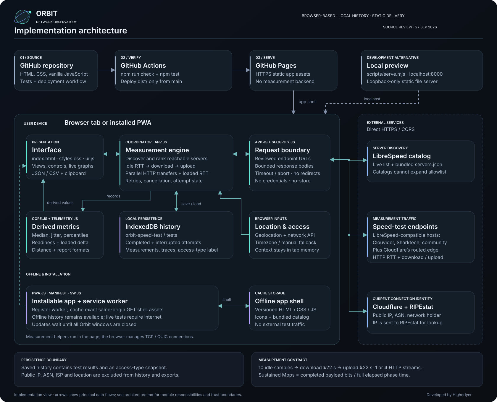
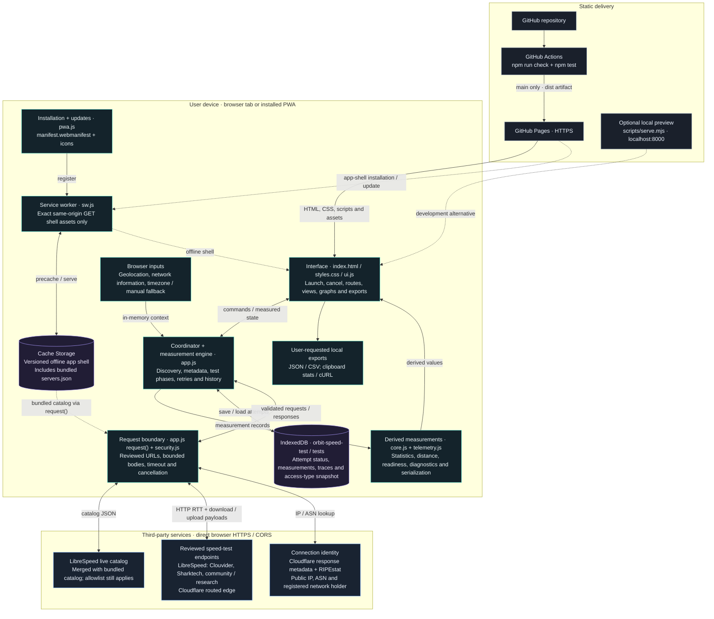

# Orbit Network Observatory — architecture

Implementation snapshot reviewed from the local project source on **27 September 2026**. This describes the existing app, including the readiness improvements; it is not a proposed redesign or a live endpoint availability audit.

[Scalable SVG](orbit-architecture.svg) · [PNG for sharing](orbit-architecture.png) · [Editable Mermaid source](orbit-architecture.mmd)

Orbit is a static browser application. GitHub Pages delivers its assets; the user's browser coordinates the tests and stores history. Measurements travel directly between the browser and reviewed public endpoints. There is no Orbit-owned API server, proxy, account service, or remote results database in this implementation.

## Editable overview

The SVG presents the main data flows. The Mermaid version below includes additional installation, catalog and export relationships. These are logical component/data-flow views: functions are grouped by responsibility, not separate processes or deployed services.

## Responsibilities and source map

| Component | Responsibility | Implementation |
| --- | --- | --- |
| Presentation | Flight gauge, route controls, Overview / Telemetry / History, popovers, charts, export actions | [`index.html`](../dist/index.html), [`styles.css`](../dist/styles.css), [`ui.js`](../dist/ui.js) |
| Coordinator and engine | Startup, connection metadata, nearby-server ranking, measurement lifecycle, retries, cancellation, record loading/saving; also updates measurement UI | [`app.js`](../dist/app.js): `connectionInfo`, `discoverServers`, `startTest`, `testAttempt`, `bandwidth`, `loadHistory`, `saveRecord` |
| Request boundary | Exact reviewed URL paths, catalog validation, bounded body consumption, validated history/IP data; request wrapper supplies abort/timeout, redirect, credential and cache policies | [`security.js`](../dist/security.js); `request` in [`app.js`](../dist/app.js) |
| Core calculations | Median, percentile interpolation, jitter, distance, location suggestions, network labels, transfer caps, activity-specific readiness | [`core.js`](../dist/core.js) |
| Telemetry formatting | Derive loaded RTT deltas and idle percentiles; resolve reviewed endpoint URLs; serialize reports and CSV; prepare diagnostic cURL | [`telemetry.js`](../dist/telemetry.js). Used by `ui.js`; depends on `SpeedCore` and `OrbitSecurity`. |
| Local history | Database `orbit-speed-test`, version 1; object store `tests`, keyed by `id`; running, completed, failed and cancelled attempts | IndexedDB functions in [`app.js`](../dist/app.js); `validRecord` in [`security.js`](../dist/security.js) |
| Installation and offline shell | Installation prompt/help, update status, service-worker registration; cache exact same-origin shell assets only | [`pwa.js`](../dist/pwa.js), [`manifest.webmanifest`](../dist/manifest.webmanifest), [`sw.js`](../dist/sw.js) |
| Server catalog | Reviewed bundled endpoints and approximate city centers; merged with the live LibreSpeed catalog, then filtered through the allowlist | [`servers.json`](../dist/servers.json), `normalizeServer` / `discoverServers` in [`app.js`](../dist/app.js) |
| Delivery | Verify source on PRs and main; publish only `dist/` on main. No build framework is required. | [GitHub Pages workflow](../.github/workflows/pages.yml), [`package.json`](../package.json) |
| Optional local preview | Loopback-only static server with fixed assets and HTTP security headers; no measurement or upload backend | [`scripts/serve.mjs`](../scripts/serve.mjs) |

The scripts are loaded in order as deferred classic scripts: `security.js` → `core.js` → `telemetry.js` → `ui.js` → `app.js` → `pwa.js`. The named helper objects are module-like closures; this is not an ES-module bundler architecture. `sw.js` runs in the separate service-worker context.

## Lifecycle

1. **Startup:** load and validate local history. When online, resolve connection identity and initialize browser-controlled location access, with timezone/manual fallbacks. An offline launch defers live discovery and identity requests until reconnection.
2. **Discovery:** merge the live and bundled server catalogs, deduplicate, apply exact endpoint and operator filters, shortlist by approximate distance, then probe with three workers. Reachable candidates are ranked by median HTTP RTT. The user may select an endpoint instead of accepting automatic selection.
3. **Launch:** create and save a running attempt, refresh stale identity if needed, and perform download/upload preflight checks. A full bandwidth test starts only after the user launches it.
4. **Measure:** warm up, collect ten idle HTTP RTT samples, run download for at least 22 seconds, then upload for at least 22 seconds. Each transfer phase uses one or four concurrent HTTP workers and a separate loaded-RTT probe loop. In-flight requests may extend the phase.
5. **Calculate and present:** divide successfully completed payload bits by the full phase elapsed time, including retry delays. Render measured traces, idle jitter/percentiles, loaded latency deltas, and activity-specific readiness. Readiness is an estimate for the selected route, not a direct game/streaming/video-call service test.
6. **Persist:** save the completed, failed or cancelled attempt. An interrupted tab can leave a running record displayed as unfinished. Completed saved results are recalculated for presentation; missing legacy telemetry is not invented.

A failed automatic attempt may restart on one other reachable endpoint, creating a separate history record. Manual endpoint selection does not silently switch servers. Cancellation and safety-budget stops do not trigger failover.

## Data and trust boundaries

| Data | Location and lifetime | External flow |
| --- | --- | --- |
| App assets, manifest, icons, bundled catalog | Hosted as static files; versioned Cache Storage on the device | GitHub Pages or local preview → browser |
| Test payloads and HTTP RTT probes | Generated upload bytes; downloaded binary data is counted and discarded. Traces and aggregate measurements become records. | Browser ↔ selected reviewed test endpoint; bypasses the service-worker cache |
| Public IP, ASN, network holder / ISP display | Current tab memory and UI; excluded from saved records and exports | Cloudflare metadata, with RIPEstat IP fallback, ASN and network-holder lookups. The public IP is sent to RIPEstat. |
| Device coordinates / selected city | Current tab memory for local distance sorting | Orbit does not send coordinates to test servers or a reverse-geocoding endpoint. Browser/OS location-provider behavior is outside Orbit's code. |
| Access-type snapshot | Source-labelled enum and performance-class fields saved with each attempt | Browser API or explicit manual choice; no SSID collection |
| History and exports | IndexedDB plus user-requested JSON/CSV downloads or clipboard content | No automatic history upload or cross-device synchronization |

Public services still receive normal request information, including the client's public IP. Location access remains browser-controlled. Cellular generations are manual labels; the Network Information API's effective type is a performance estimate, not proof of 3G/4G/5G access.

## Security and offline boundaries

- The request wrapper and `OrbitSecurity` are **browser code**, not a reverse proxy, firewall service, or server-side authorization layer. Catalog refreshes cannot add unreviewed destinations. The page's meta CSP provides an additional browser policy.
- Binary and JSON body sizes, request timeouts, worker counts, retry counts, probe counts and the shared planned-payload budget are bounded. These limits do not guarantee a bandwidth bill or endpoint availability.
- The service worker caches exact same-origin GET shell assets. External test traffic, metadata, catalog traffic and all uploads bypass it. Cache cleanup is scoped to this app's cache prefix and does not clear IndexedDB history.
- Updates wait for the normal worker lifecycle; the app does not force replacement or reload during a measurement. Offline use covers the app shell, saved history, graphs and exports, not fresh speed tests.
- GitHub Pages and the local preview have different HTTP-header capabilities. The local server sets security headers; do not infer that all of those headers exist on Pages from the diagram. See [SECURITY.md](../SECURITY.md).
- History belongs to the browser storage context and origin. Browser data clearing/eviction can remove it; same-origin code and extensions are separate trust considerations. Installation does not create a remote database.

## Maintaining the diagram

Edit `orbit-architecture.mmd` for the logical Mermaid graph. `orbit-architecture.svg` is the standalone styled vector view, and `orbit-architecture.png` is its raster export. Update both views when responsibilities or boundaries change. The diagram files are documentation under `docs/`, outside the deployed `dist/` app shell.
